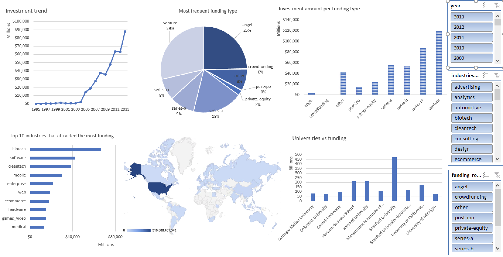
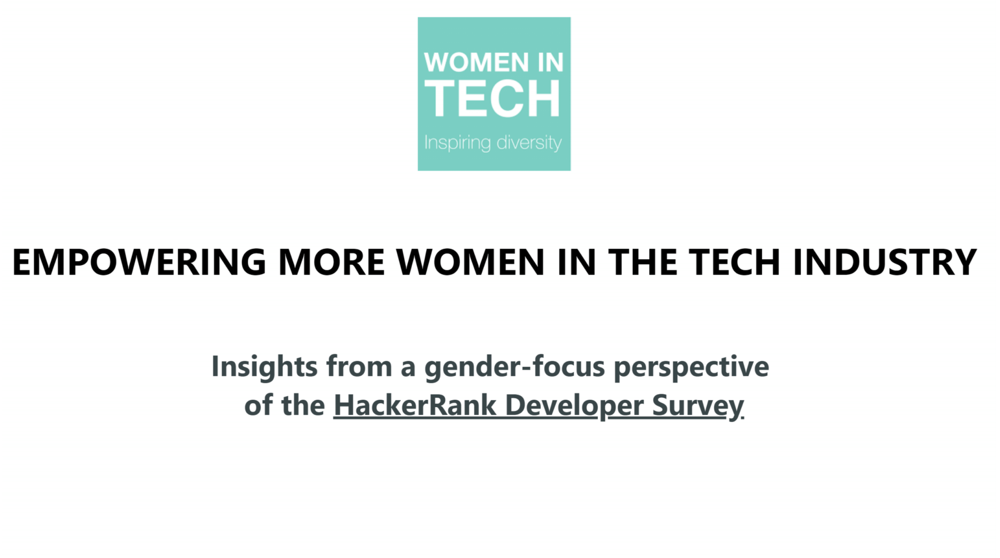
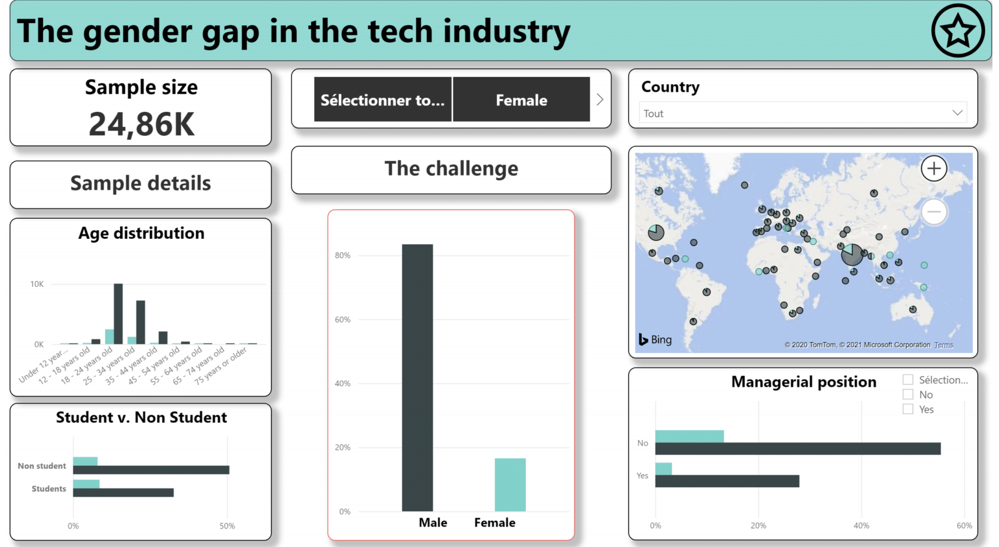
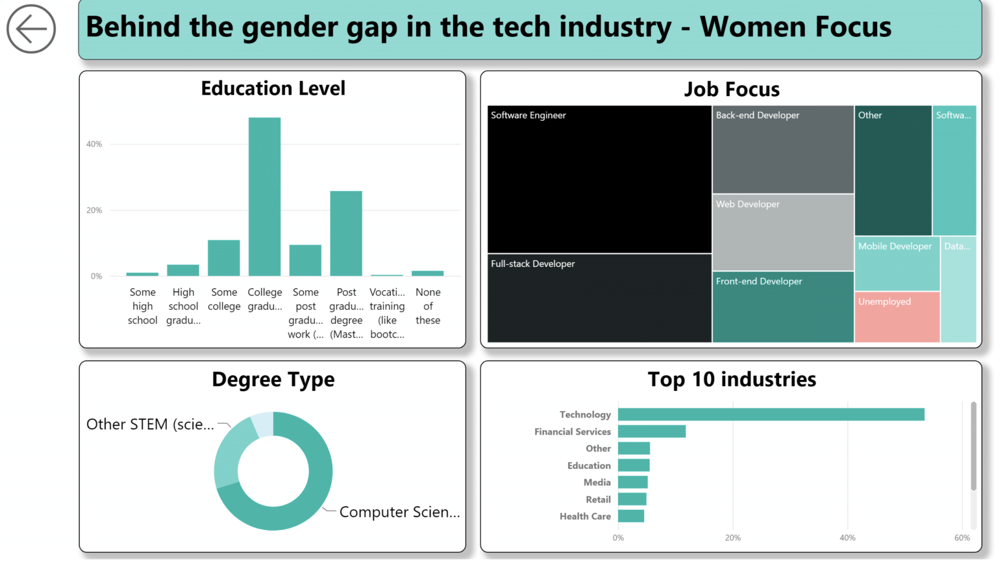
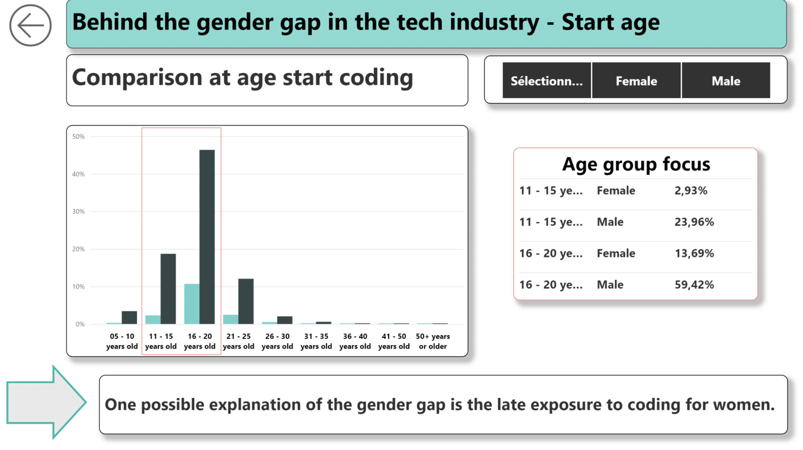
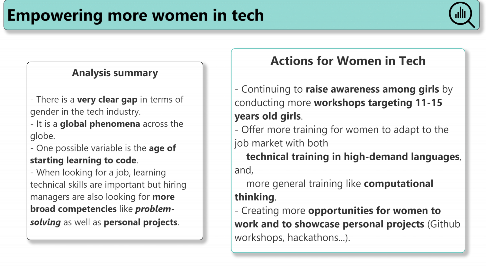

## Portfolio

Welcome to my portfolio page where you can find my learning projects in data analysis. 

---

### Data visualisation

#### [Analysing the Crunchbase dataset with SQL](pages/crunchbase.md)

#### [Empowering more women in the tech industry - Insights from a gender-focus perspective of the HackerRank Developer Survey](/pages/HackerRank-WomenInTech.md)

| | |
| ----------- | ----------- |
|  |   |
|   |   |
|  |  |

---

### Other data projects 

#### [Exploring the CIA factbook with SQL & Jupyter](https://github.com/tuyenshares/exploring-CIA-factbook-using-SQL)
