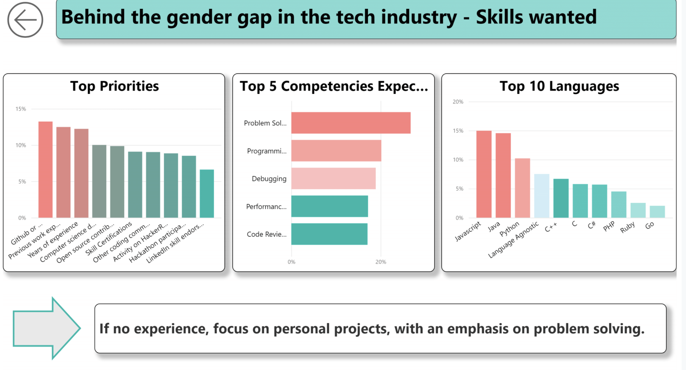

## Portfolio

Welcome to my portfolio page where you can find my learning projects in data analysis. 

---

### Visualisation projects

#### Project 1

[Exploring the Crunchbase dataset with SQL](pages/crunchbase.md)

#### Project 2

[Empowering more women in the tech industry - Insights from a gender-focus analysis of the HackerRank Developer Survey](/pages/HackerRank-WomenInTech.md)

|  |   |
| ----------- | ----------- |
|   |   |
|  |  |

---

### Other data analytics projects 
